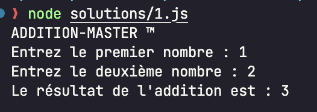
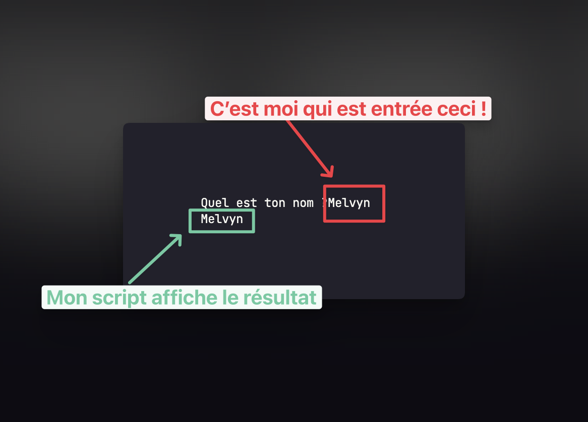
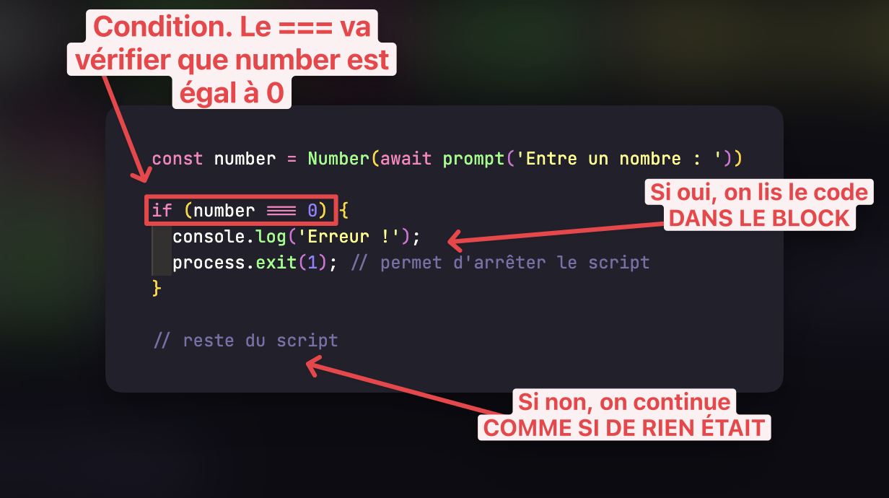

Dans cet exercice, nous allons créer "ADDITION-MASTER ™️" ! C'est une petite application qui permet d'additionner deux nombres.

Je tiens à te dire que **tu ne sais pas encore comment faire**, mais je te lance directement dans la fosse aux lions avec un exercice **compliqué** afin de maximiser ta compréhension.

C'est ce que j'appelle la **difficulté désirable**, ton cerveau mémorise mieux les choses si tu es en difficulté.

Dans cet exercice, nous allons utiliser des notions que j'expliquerai dans la suite du cours... Le but ici est de te débrouiller, d'échouer, de réessayer, puis de regarder les vidéos solutions pour apprendre rapidement.

Pourquoi ?

Le fait de voir "vite fait" plein de sujets _que tu ne connais pas encore_ va créer de la curiosité, et quand je t'expliquerai comment ça fonctionne, le fait d'avoir fait un exercice maintenant te fera retenir entre 2x et 3x mieux.

N'oublie pas que tout ce que je fais, c'est pour maximiser ta compréhension globale. Et surtout, n'oublie pas que si c'est compliqué, c'est que **tu apprends**.

## Partie 1 - Simple addition

Dans le fichier [script.js](./script.js), tu trouveras un code rempli de commentaires. Ta tâche est de faire en sorte que quand je lance le script, j'obtienne le résultat suivant :



Pour cela, tu vas utiliser plein de choses que tu ne connais pas encore, mais ce n'est pas grave, tu vas apprendre en faisant.

1. La fonction `prompt` que j'ai créée dans [helper.js](./helper.js), qui te permet de récupérer l'input d'un utilisateur.

Tu ne connais pas encore les fonctions, mais ne t'en fais pas. Il te suffit pour l'instant de savoir **comment les utiliser** :

```js
const result = await prompt('Quel est ton nom ?');
console.log(result);
```

Cela fera apparaître ceci :



Le `await` permet d'**attendre** que l'utilisateur écrive et appuie sur entrée.

Le `result` est toujours une **chaîne de caractères** (string) car c'est ce que l'utilisateur a écrit.

2. Transformer une chaîne de caractères en nombre

Dans notre exercice, nous devrons transformer une chaîne de caractères en un nombre. Pour cela, nous utiliserons la fonction `Number` qui fait cela !

```js
const result = Number('123');
console.log(result); // 123
```

3. Afficher un résultat

Pour afficher le résultat, tu auras besoin d'utiliser une opération arithmétique. Je te laisse consulter [l'opération "+"](https://developer.mozilla.org/fr/docs/Web/JavaScript/Reference/Operators/Addition) pour trouver la bonne.

Ensuite, tu peux afficher le résultat en utilisant `console.log`, qui accepte plusieurs arguments.

```js
const a = 1;
const b = 2;

console.log('Variable A : ', a, ', Variable B : ', b);
// Variable A : 1, Variable B : 2
```

Allez, je te laisse te lancer

, on se retrouve dans la solution !

## Partie 2 - Soustraction

Maintenant que tu as réussi à faire une addition, nous allons faire une soustraction. Tu peux garder le même code, mais le modifier pour utiliser une soustraction.

- [Opérateur de soustraction](https://developer.mozilla.org/fr/docs/Web/JavaScript/Reference/Operators/Subtraction)

## Partie 3 - Division (bonus)

Maintenant que tu as réussi à faire une soustraction, nous allons faire une division. Celle-ci est un peu plus compliquée car il faut gérer le cas où l'utilisateur entre 0 pour le deuxième nombre.

Si l'utilisateur entre 0, tu dois afficher un message d'erreur et arrêter le script.

Pour cela, nous allons utiliser le `if`, que nous verrons dans la suite.

```js
const number = Number(await prompt('Entre un nombre : '));

if (number === 0) {
  console.log('Erreur !');
  process.exit(1); // permet d'arrêter le script
}

// reste du script
```

Le `if` permet d'afficher du rendu conditionnellement. Ensuite, si le "process.exit(1)" est appelé, nous arrêtons totalement le script et affichons une erreur.

Étant donné que nous arrêtons le script, la suite du code ne sera jamais exécutée.



## Partie 4 - isNaN (bonus)

Fait un test... lorsque que le programme te demande d'inscrire un nombre, si tu écris un mot, que se passe-t-il ?

Réponse : la conversion produit `NaN` (Not a Number).

C'est la manière que JavaScript a de dire "je ne sais pas ce que c'est, mais en tout qu'à c'est pas un nombre".

C'est très pratique car ça nous permet de **savoir** que l'utilisateur n'a pas inscrit la bonne valeur et donc de pouvoir afficher une erreur !

Ton travail, est d'utiliser le `if` avec la fonction `Number.isNaN` pour afficher une erreur lorsque l'utilisateur n'entre pas un nombre.

Voici ce que ça devrait donner :

```bash
ADDITION-MASTER ™️
Enter the first number : aaa
Error : firstNumber is not a number
```

Pour faire ça, il faut utiliser les `if` comme on l'a fait précédemment en vérifiant que le nombre est `NaN`.

```js
if (Number.isNaN(number)) {
  // Si le code rentre ici, c'est que le nombre est NaN
  // Afficher une erreur et arrêter le script
}
```
