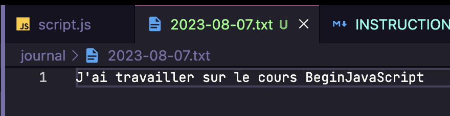

# JournalCLI - Async / Await

Dans cet exercice, on retourne aux sources : **NodeJS** et le terminal !

On va créer cette fois un CLI qui va permettre de gérer un journal de bord.

On pourra faire des commandes, comme `git add` mais ici ce seront nos propres commandes :

```bash
$ node script.js add today "J'ai travaillé sur le cours BeginJavaScript"
Votre entrée a été ajoutée !
```

Et après cette commande, il y a un nouveau fichier qui a été ajouté dans



On va avoir d'autres commandes :

```bash
$ node script.js help

Usage:
- Pour lister les entrées : node journal.js list
- Pour ajouter une entrée : node journal.js add <date> <content>
- Pour modifier une entrée : node journal.js modify <date> <new_content>
- Pour supprimer une entrée : node journal.js delete <date>
- Pour rechercher une entrée : node journal.js search <query>
```

Comme tu le vois, on va faire 5 commandes qui vont permettre de gérer notre journal de bord.

## Partie 1 : Add et List

On va commencer par créer la fonctionnalité pour ajouter une entrée dans le journal de bord et pour lister les entrées que l'on a depuis le départ.

Les entrées vont se situer dans `/journal`.

Pour récupérer le chemin de notre dossier, on va utiliser :

```js
const journalDir = path.join(process.cwd(), "journal");
```

Ici `journalDir` représente le chemin qui va à notre dossier, n'hésite pas à le log.

Dans notre script, on va utiliser les modules NodeJS `fs/promises` et `path` pour gérer notre dossier.

La première étape va être de récupérer notre dossier. Pour ça, on va utiliser les méthodes `fs.access` pour vérifier que le dossier existe et `fs.mkdir` pour le créer s'il n'existe pas.

Tu peux retrouver la documentation des différentes méthodes utilisées dans ce module ici :

- [fs.access](https://nodejs.org/api/fs.html#fspromisesaccesspath-mode) : pour accéder à un fichier, throw une erreur s'il n'existe pas
- [fs.mkdir](https://nodejs.org/api/fs.html#fspromisesmkdirpath-options) : pour créer un fichier
- [fs.readFile](https://nodejs.org/api/fs.html#fspromisesreadfilepath-options) : pour lire un fichier
- [fs.readDir](https://nodejs.org/api/fs.html#fspromisesreaddirpath-options) : pour lire un dossier
- ... (cherche dans la doc ou demande à ChatGPT)

Avec toutes ces méthodes, on va pouvoir créer une première fonction `ensureJournalDirExists` qui vérifie que le dossier fonctionne bien. Cette fonction va accéder au dossier `/journal` et va le créer s'il n'existe pas. S'il n'existe pas, la fonction va throw une erreur qu'il faudra catch.

Essaie d'appeler cette fonction au début de ton script pour voir si elle fonctionne bien. Normalement, le dossier est maintenant créé.

#### Création de notre commande

On va créer une fonction `main` qui va être `async` et qui va appeler `ensureJournalDirExists`.

Pour récupérer les arguments de notre fonction, par exemple si je fais `node script.js delete 12.12.12`, j'ai envie de récupérer `delete` et `12.12.12.12`. Pour ça, on peut utiliser `process.env.argv`. Cette variable est un tableau qui contient les arguments de notre commande.

Si tu l'affiches, tu devrais voir ça :

```js
$ node script.js help
[
  '/Users/melvynx/.nvm/versions/node/v19.3.0/bin/node',
  '/Users/melvynx/BRAIN/1.PROJECTS/BEGINJAVASCRIPT/code/setup-vscode/script.js',
  'help'
]
```

Les deux premiers arguments ne nous intéressent pas, on va donc utiliser `slice` pour récupérer les arguments qui nous intéressent.

```js
const args = process.argv.slice(2);
```

Puis on va pouvoir faire un `switch` sur le premier argument pour appeler la bonne fonction.

```js
switch (args[0]) {
  case "add":
    await addEntry(args[1], args.slice(2).join(" "));
    break;
  case "list":
    await listEntries();
    break;
  default:
    console.log(`
Usage:
- Pour lister les entrées : node journal.js list
- Pour ajouter une entrée : node journal.js add <date> <content>
`);
}
```

Ici `args.slice(2).join(" ")` va venir encore une fois supprimer les deux premiers éléments, qui seraient ici par exemple `add` et `12.12.12`, et va venir joindre le reste avec un espace.

#### List

Pour lister nos entrées, il va falloir utiliser `fs.readdir` pour récupérer les fichiers dans notre dossier `/journal`.

Cette commande va te retourner un tableau de strings qui représente le nom de nos fichiers.

Tu vas pouvoir afficher ce nom dans la console.

#### Add

Si le premier argument de add est égal à `today`, tu vas définir la date comme étant `new Date().toISOString().slice(0, 10);` pour utiliser la date du jour.

Puis tu vas devoir reconstituer le `path` du fichier en utilisant [`path.join`](https://www.w3schools.com/nodejs/met_path_join.asp).

Tu vas pouvoir utiliser `fs.readFile` avec `await` pour récupérer le contenu, si le fichier n'existe pas tu auras une erreur.

Tu vas "additionner" ce contenu avec les paramètres de la fonction `addEntry` et tu vas utiliser `fs.writeFile` pour écrire le contenu dans le fichier.

#### Conclusion !

Au boulot ! Tu as les émojis pour t'aider. N'hésite pas à utiliser la doc et MDN pour t'aider. La doc `NodeJS` est un peu compliquée à lire.

Fais attention quand tu cherches sur Google de tomber sur les articles qui parlent de async car souvent tu vas tomber [sur ce genre d'exemple](https://www.geeksforgeeks.org/node-js-fs-readfile-method/) qui contiennent l'ancienne manière de faire avec les callbacks.

Donc rajoute toujours `async` dans tes requêtes pour voir le code d'exemple. Tu trouverais par exemple [cette réponse pour readFile qui est bien meilleure.](https://stackoverflow.com/questions/46867517/how-to-read-file-with-async-await-properly).

## Partie 2 : Delete

Pour la partie `delete`, tu vas rajouter un nouveau cas dans notre `switch` afin de gérer le delete.

Tu vas devoir premièrement vérifier que le fichier existe en essayant de lire son contenu, si ce n'est pas le cas, tu affiches une erreur.

Puis tu vas demander à l'utilisateur s'il est sûr de vouloir supprimer l'entrée. Pour ça, tu peux utiliser la fonction async `prompt` que je t'ai mise dans le fichier `helper.js` et que j'ai déjà importée.

S'il dit oui, tu supprimes. Sinon, tu annules et tu passes à autre chose.

Pour supprimer, tu peux utiliser [`fs.unlink`](https://nodejs.org/api/fs.html#fspromisesunlinkpath).

## Partie 3 : Search et open

Cette partie est la plus intense. De la même manière que `delete`, tu vas ajouter un nouveau cas dans notre `switch` afin de gérer le search.

Tu vas devoir ensuite gérer le cas suivant :

- Si l'utilisateur a déjà rentré un contenu à chercher, tu l'utilises
- Sinon, tu utilises la méthode `prompt` pour demander le texte à rechercher.

Tu vas ensuite utiliser `fs.readdir` pour récupérer la liste des fichiers dans le dossier `/journal`.

Puis tu vas devoir "lire" tous les fichiers pour voir s'ils contiennent le texte recherché. Pour ça, tu vas utiliser `fs.readFile` et tu vas utiliser `includes` pour voir si le texte est présent.

Attention, pour être plus rapide, tu peux te servir de [`Promise.all`](https://developer.mozilla.org/en-US/docs/Web/JavaScript/Reference/Global_Objects/Promise/all) qui permet d'effectuer toutes tes recherches en "parallèle".

S'il n'y a aucune entrée qui contient le texte recherché, tu affiches un message d'erreur.

Sinon, tu affiches la liste des entrées qui contiennent le texte recherché.

Tu ajouteras aussi la méthode `openEntry` ainsi que son action pour pouvoir lire le contenu d'un fichier.

## Conclusion

Dans cet exercice, tu as pu pratiquer le async / await avec NodeJS et tu as pu voir comment utiliser les fonctions de base de NodeJS.

Dans la suite du cours, on va mieux comprendre comment fonctionne l'async / await et on va voir comment utiliser les `Promise` et les `async function` pour créer nos propres fonctions asynchrones.
